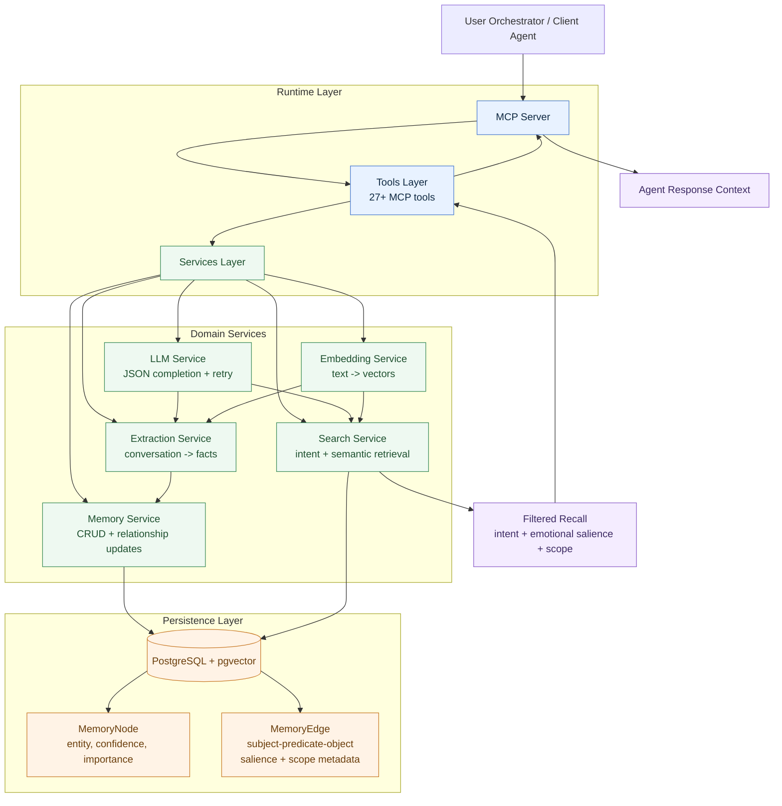

# Eidolon Agent Memory Architecture

This page shows the main runtime and data-flow path from conversation input to memory retrieval and MCP tool response.

## Notes

- Extraction and retrieval are both embedding-assisted but governed by intent and metadata.
- Emotional salience and scope are first-class fields on relationships, enabling graceful omission behavior.
- Tools are the only external interface; services and storage are internal implementation layers.
